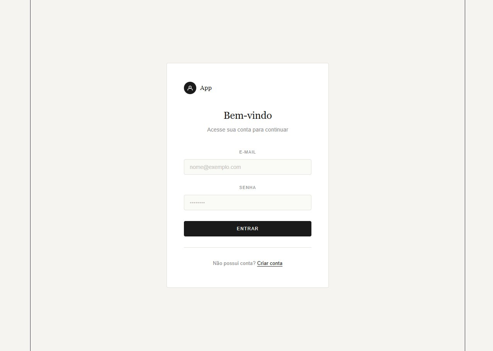

# Projeto React + Firebase

Aplicação web de autenticação construída com **React** e **Firebase Authentication**. Permite que usuários criem uma conta e façam login com e-mail e senha.

---

## Screenshot



---

## Como funciona

O app tem duas telas principais:

- **Tela de autenticação** — o usuário informa e-mail e senha para entrar ou criar uma conta.
- **Tela do usuário logado** — exibe o e-mail da conta e um botão para sair.

O Firebase cuida de todo o processo de autenticação (criação de conta, login, sessão). O React gerencia o estado da interface e reage automaticamente quando o usuário entra ou sai.

### Estrutura de arquivos relevante

```
src/
├── firebase.js          # Inicialização do Firebase
├── App.jsx              # Componente principal, gerencia estado e lógica
├── services/
│   └── auth.js          # Funções de login, cadastro e logout
└── components/
    ├── AuthForm.jsx      # Formulário de login/cadastro
    ├── UserContent.jsx   # Tela do usuário autenticado
    └── Loading.jsx       # Indicador de carregamento
```

---

## Pré-requisitos

Antes de começar, você precisa ter instalado na sua máquina:

- [Node.js](https://nodejs.org/) (versão 18 ou superior)
- [Git](https://git-scm.com/)
- Uma conta no [Firebase](https://firebase.google.com/)

---

## Configurando o Firebase

1. Acesse o [Console do Firebase](https://console.firebase.google.com/) e crie um novo projeto.
2. Dentro do projeto, clique em **"Adicionar app"** e escolha a opção **Web** (`</>`).
3. Copie o objeto `firebaseConfig` que será exibido.
4. No menu lateral, vá em **Authentication → Sign-in method** e ative o provedor **E-mail/senha**.

---

## Rodando na sua máquina

### 1. Clone o repositório

```bash
git clone https://github.com/seu-usuario/seu-repositorio.git
cd seu-repositorio
```

### 2. Instale as dependências

```bash
npm install
```

### 3. Configure o Firebase

Abra o arquivo `src/firebase.js` e substitua os valores pelo seu `firebaseConfig`:

```js
const firebaseConfig = {
  apiKey: "SUA_API_KEY",
  authDomain: "SEU_PROJETO.firebaseapp.com",
  projectId: "SEU_PROJETO",
  storageBucket: "SEU_PROJETO.firebasestorage.app",
  messagingSenderId: "SEU_SENDER_ID",
  appId: "SEU_APP_ID"
};
```

### 4. Inicie o servidor de desenvolvimento

```bash
npm run dev
```

Acesse [http://localhost:5173](http://localhost:5173) no navegador.

---

## Comandos disponíveis

| Comando | Descrição |
|---|---|
| `npm run dev` | Inicia o servidor local |
| `npm run build` | Gera a versão de produção na pasta `dist/` |
| `npm run preview` | Visualiza o build de produção localmente |

---

## Tecnologias utilizadas

- [React 19](https://react.dev/)
- [Vite](https://vitejs.dev/)
- [Firebase 12](https://firebase.google.com/)
